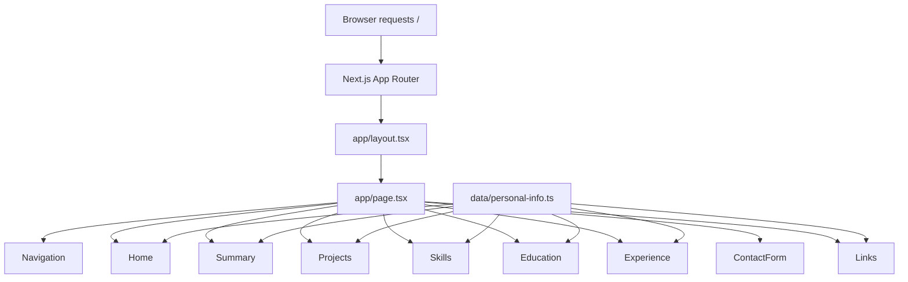
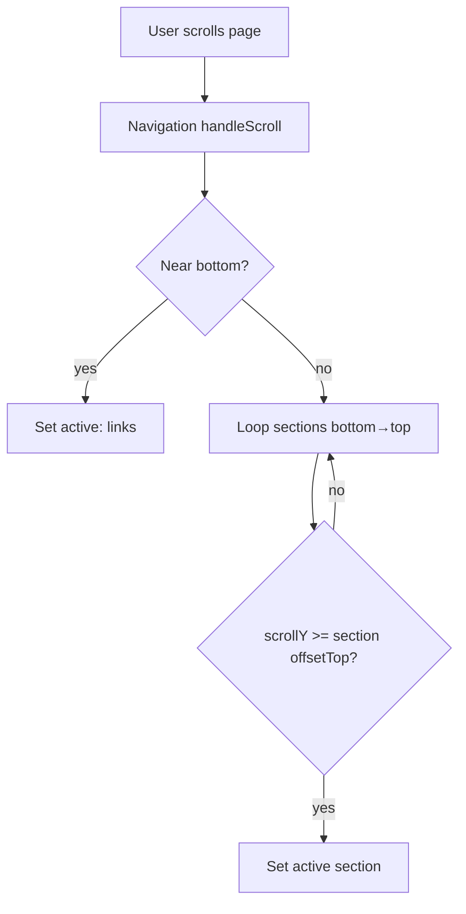
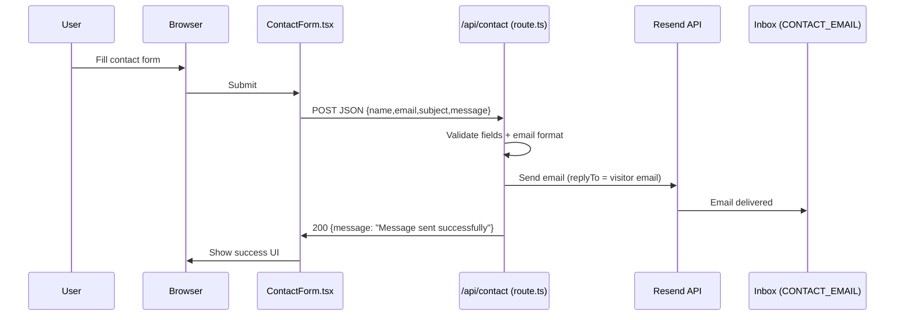
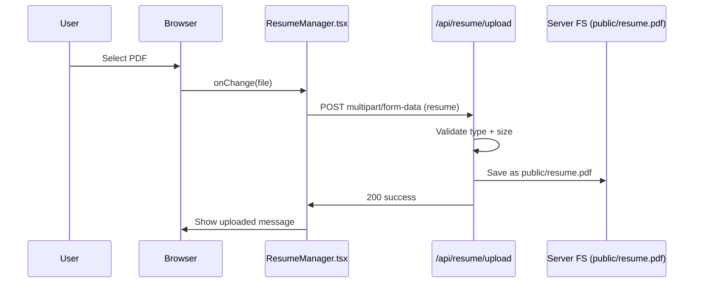
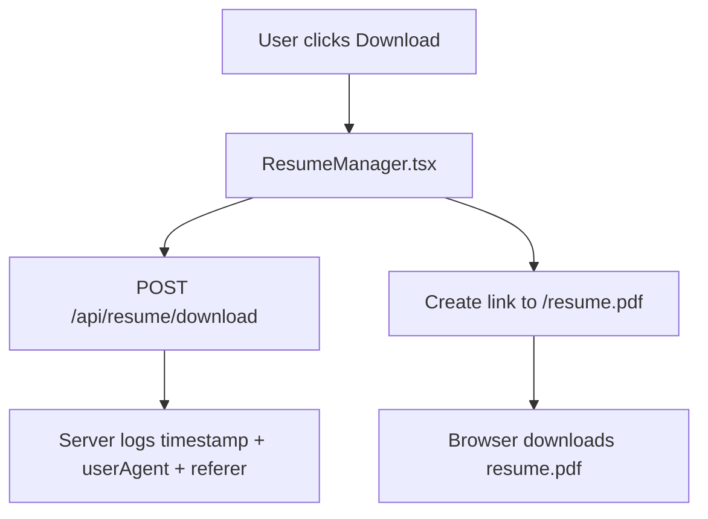

# Project Details + Flow Chart

This project is a **portfolio website** built with:
- **Next.js (App Router)**: pages and API routes live under `app/`
- **React**: UI components under `components/`
- **Tailwind CSS**: styling via utilities + `app/globals.css`
- **Framer Motion**: scroll animations

---

## 1) Folder & Responsibilities

### `app/`
- `app/layout.tsx`: root HTML layout, global background, imports `app/globals.css`
- `app/page.tsx`: assembles the portfolio page by rendering each section component
- `app/api/*`: server endpoints (runs on server)
  - `app/api/contact/route.ts`: receives contact form data and sends email via Resend
  - `app/api/resume/upload/route.ts`: uploads `resume.pdf` into `public/`
  - `app/api/resume/download/route.ts`: tracks resume download (currently logs only)

### `components/`
UI sections (each one maps to a page section with an `id` used by navigation scroll):
- `Navigation.tsx`: header nav + theme toggle + active section logic
- `Home.tsx`: hero section (email/phone/location cards)
- `Summary.tsx`, `Projects.tsx`, `Skills.tsx`, `Education.tsx`, `Experience.tsx`
- `ContactForm.tsx`: “Get In Touch” form which POSTs to `/api/contact`
- `Links.tsx`: social links
- `ScrollAnimation.tsx`: shared animation wrapper (Framer Motion)

### `data/`
- `data/personal-info.ts`: **single source of truth** for your portfolio content (name, email, projects, skills, etc.)

### `public/`
Static files served directly:
- `public/resume.pdf` (downloadable resume)
- `public/photo.jpg` (profile photo)

---

## 2) Main Page Render Flow

`app/page.tsx` renders one single page and stacks sections in order.



---

## 3) Navigation & Active Section Logic

The nav is a **client component**.
- On scroll it finds which section is currently in view (`home`, `summary`, `projects`, etc.)
- On click it `scrollIntoView()` to the section
- Dark mode toggles `document.documentElement.classList` with `dark`



---

## 4) Contact Form → Direct Email (Get In Touch)

### What happens
- User submits form in `components/ContactForm.tsx`
- Browser sends `POST /api/contact` with JSON body
- Server validates
- Server sends an email to **CONTACT_EMAIL** using **Resend**

### Environment variables
Stored in `.env.local`:
- `RESEND_API_KEY=...`
- `CONTACT_EMAIL=rajandobariya6@gmail.com`
- `RESEND_FROM=Portfolio <onboarding@resend.dev>` (set to a verified sender for production)



---

## 5) Resume Upload (Admin-style feature)

`app/api/resume/upload/route.ts` accepts a PDF upload and writes it to `public/resume.pdf`.



Note: This endpoint has **no authentication** right now. If deployed publicly, anyone could upload unless you protect it.

---

## 6) Resume Download Tracking

The download button:
- Fires a tracking request to `POST /api/resume/download`
- Then downloads the file `public/resume.pdf`



---

## 7) What to change most often

- Content: `data/personal-info.ts`
- Styling: `app/globals.css` and `tailwind.config.ts`
- Contact email: `.env.local` (do NOT commit)

---

## 8) Quick Run Commands

```bash
npm install
npm run dev
```

Production:
```bash
npm run build
npm start
```
